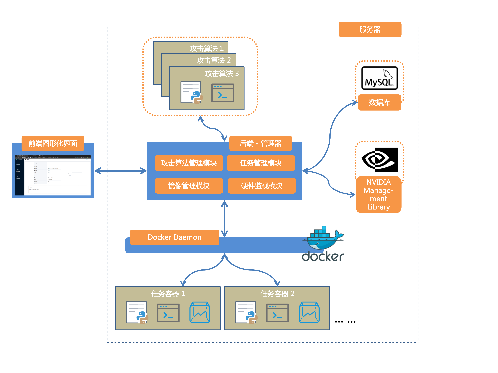

# Container Dispatcher

Container Dispatcher 将 docker 功能再次封装为友好的 WEB 界面，它能够帮助研究者更快速地在容器中验证攻击算法对模型的影响。



## 部署需求

* Docker Engine > 19.03
* MySQL or MariaDB
* （如果需要编译）go > 1.13

## 编译及部署

1. 克隆仓库

2. 编译（可以跳过，直接使用仓库中已经编译好的二进制文件）
    ```shell
    $ go mod tidy
    $ go build main.go
    ```

3. 在 MySQL 中创建名为 `container` 的数据库
4. 执行本仓库中的 `dao/export.sql` 在数据库中创建表和初始化数据
5. 配置 `conf` 下的数据库连接地址
6. 以管理员权限运行
   ```shell
   $ sudo main
   ```

## 代码结构

```
container-dispatcher
├── certs                     存放证书                        
│   ├── ca.crt
│   ├── private.crt
│   ├── private.csr
│   ├── private.key
│   ├── public.key
│   └── server.pem
├── conf                      配置文件
│   ├── dev
│   └── pm2
├── controller                API 对应的处理函数
│   ├── algo_manager.go       算法管理 API
│   ├── container.go          容器管理 API (Deprecated)
│   ├── image.go              Docker 镜像管理 API
│   ├── login.go
│   ├── resource.go           资源 API
│   ├── task.go               任务 API
│   └── user.go               用户管理 API
├── dao                       Data Access Object 数据访问对象
│   ├── algo_manage.go
│   ├── container.go
│   ├── example.sql
│   ├── export.sql
│   ├── task.go
│   └── user.go
├── dockerfiles
│   ├── AIJack.dockerfile
│   └── start.sh
├── docs                      Swagger API Docs
│   ├── docs.go
│   ├── swagger.json
│   └── swagger.yaml
├── dto                       Data Transfer Object 数据传输对象
│   ├── algo_manager.go
│   ├── container.go
│   ├── image.go
│   ├── resource.go
│   ├── task.go
│   └── user.go
├── go.mod
├── go.sum
├── lib
│   ├── conf.go
│   ├── context.go
│   ├── docker.go
│   ├── file.go
│   ├── func.go
│   ├── log.go
│   ├── mysql.go
│   └── redis.go
├── log
│   ├── config.go
│   ├── console_writer.go
│   ├── file_writer.go
│   ├── log.go
│   └── log_test.go
├── logs
│   ├── golang_common.inf.log
│   └── golang_common.wf.log
├── main
├── main.go
├── middleware                请求拦截中间件
│   ├── cors.go
│   ├── ip_white_list.go
│   ├── recovery.go
│   ├── request_log.go
│   ├── response.go
│   ├── session_auth.go
│   ├── translation.go
│   └── validator-basic.go
├── public
│   ├── const.go
│   ├── log.go
│   ├── params.go
│   └── utils.go
├── README.md
├── router                    路由
│   ├── httpserver.go
│   └── router.go
├── static           
│   ├── attack
│   ├── image
│   ├── task
│   └── test.py
├── test
│   ├── test.go
│   └── test_test.go
├── test.http
└── tmp
    └── README
```

### 算法管理

文件位于 `controller/algo_manager.go`。用户可以上传攻击算法供其他用户使用。下面是算法管理使用的 API：

```go
func AlgorithmControllerRegister(group *gin.RouterGroup) {
	ac := &AlgorithmController{}

	group.POST("/upload", ac.AlgorithmUploadNew)        // 上传算法文件接口
	group.POST("/new", ac.NewAttackAlgorithm)           // 新建算法接口，调用后修改数据库
	group.GET("/list", ac.ListAttackAlgorithms)         // 获取算法列表
	group.GET("/remove/:algo_id", ac.RemoveAlgorithm)   // 软删除算法，参数是算法ID
}
```

### 硬件资源信息

`controller/resource.go` 用户可以通过调用接口获取硬件资源信息和当前状态

```go
func ResourceControllerRegister(group *gin.RouterGroup) {
	res := &ResourceController{}
	group.GET("/gpu", res.ResourceGPUList)              // 获取 GPU 信息
	group.GET("/cpu", res.ResourceCPUList)              // 获取 CPU 信息
	group.GET("/gpu/cache/update", res.UpdateGPUSelectionList)      // 更新 GPU 信息缓存
	group.GET("/gpu/cache", res.GetGPUSelectionList)                // 获取 GPU 信息缓存
}
```

### 任务管理

`controller/task.go` 任务管理模块负责任务创建和运行

```go
func TaskControllerRegister(group *gin.RouterGroup) {
	tc := &TaskController{}
	group.POST("/upload", tc.TaskUploadFiles)               // 上传任务文件接口
	group.POST("/new", tc.NewTask)                          // 新建任务接口
	group.GET("/list", tc.ListTasks)                        // 获取任务列表
	group.GET("/detail/:task_id", tc.TaskDetail)            // 获取任务详情
	group.GET("/run/:task_id", tc.RunTaskTest)              // 创建容器并执行任务
	group.GET("/stop/:task_id", tc.StopTask)                // 提前终止任务容器
	group.GET("/log/:task_id", tc.ShowTaskLog)              // 获取任务容器的日志
	group.GET("/remove/:task_id", tc.RemoveTask)            // 删除任务文件，数据库中软删除任务信息

	group.StaticFS("/file/", gin.Dir(lib.GetStringConf("base.task_file.directory"), true))      // 静态文件服务器
	group.GET("/dir/:task_id", tc.GetTaskFiles)             // 获取任务文件夹下的文件
	group.GET("/pack", tc.PackAndDownloadFiles)             // 任务文件打包下载
}
```

### 镜像管理

`controller/image.go`

```go
func ImageControllerRegister(group *gin.RouterGroup) {
	img := &ImageController{}
	group.GET("/list", img.ImagesList)                      // 获取镜像列表
	group.POST("/upload", img.UploadImage)                  // 上传并添加一个镜像文件
	group.GET("/remove/:image_id", img.RemoveImage)         // 删除镜像
	group.GET("/pull", img.PullImage)                       // 从 Docker Hub 拉去一个镜像
}
```

## 如何添加新的功能

请参考 gin 文档，在 `controller` 文件夹下编写新的 Handler，然后在 `router/router.go` 中注册即可在应用中引入这些新的 API Handler。
